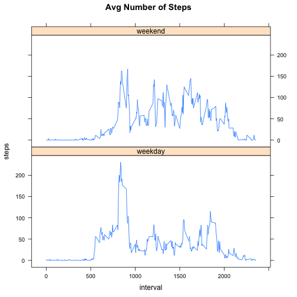

# Reproducible Research: Peer Assessment 1

## Loading and preprocessing the data

Ensure that your working directory is set to the location of activity.zip


```r
data <- read.csv(unz("activity.zip","activity.csv"),header=TRUE)
```
## What is mean total number of steps taken per day?

Set the scientific notation display option

```r
options(scipen=10)
```


```r
countSteps <- aggregate(steps ~ date, data, sum)
hist(countSteps$steps, breaks = 20, main = "Total Number of Steps Taken Each Day")
```

 

```r
mean(countSteps$steps)
```

```
## [1] 10766
```

```r
median(countSteps$steps)
```

```
## [1] 10765
```

The mean total steps taken per day is 10766.1887
The median total steps taken per day is 10765

## What is the average daily activity pattern?

```r
avgsteps <- aggregate(steps ~ interval, data, mean)
plot.ts(avgsteps$steps, main="average number of steps taken in each 5-min interval")
```

 

The 5-min interval with the maximum average steps is 104

## Imputing missing values

The total number of missing values in the dataset is 2304

Replace the missing values with the avg steps taken for that interval

```r
newdata <- data
newdata$intavg <- avgsteps[match(newdata$interval, avgsteps$interval),"steps"]
newdata$steps[is.na(newdata$steps)] <- newdata$intavg[is.na(newdata$steps)]
```
Show histogram of total no of steps taken each day

```r
countSteps2 <- aggregate(steps ~ date, newdata, sum)
hist(countSteps2$steps, breaks = 20, main = "Total No of Steps Taken Each Day")
```

 

The mean of the steps taken each day is 10766.1887 

The difference from the original mean is 0

The median of the staps taken each day is 10766.1887

The difference from the original median is 1.1887


## Are there differences in activity patterns between weekdays and weekends?

Add a weekday/weekend factor 


```r
newdata.date.f <- factor(weekdays(as.POSIXct(newdata$date)) == "Saturday" | weekdays(as.POSIXct(newdata$date)) == "Sunday", labels=c("weekday","weekend"))
```

Calculate and plot the avg daily steps grouped by the factor


```r
avgdailysteps <- aggregate(steps ~ interval + newdata.date.f, newdata, mean)
library("lattice")
xyplot(steps ~ interval | newdata.date.f, avgdailysteps , type = "l", layout = c(1,2,1), main = "Avg Number of Steps")
```

 
